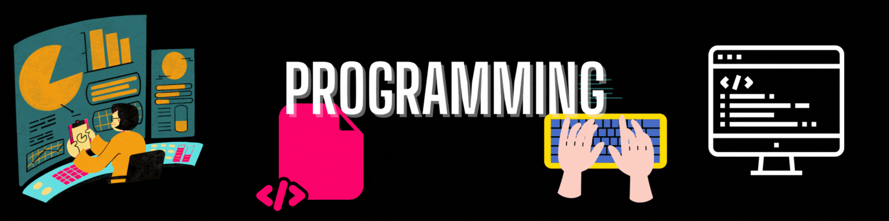

  

  

  

  

### 💫 About Me

<table>
  <tr>
    <td width="55%" valign="top">
       
      <ul>
        <li>🌱 <b>Currently:</b> Learning <b>Front-End Development (HTML, CSS, JS)</b></li>
        <li>🐍 <b>Strengthening:</b> Fundamentals in <b>Python & Java</b></li>
        <li>👨‍💻 <b>My Work:</b> All my projects are at <a href="https://github.com/Mahamm-Nadeem">github.com/Mahamm-Nadeem</a></li>
        <li>💬 <b>Ask me:</b> Basic Python, Java, problem-solving, and UI concepts</li>
        <li>📫 <b>Reach me:</b> <a href="mailto:mahamnadeemm21@gmail.com">mahamnadeemm21@gmail.com</a></li>
        <li>🧠 <b>Background:</b> CS undergraduate building skills through practical apps</li>
        <li>⚡ <b>Fun fact:</b> I break code more than I write it — but that’s how I learn! 😄</li>
      </ul>
    </td>
    <td width="45%" align="center" valign="middle">
      
    </td>
  </tr>
</table>

### 🛠 Languages and Tools

  

### 🤝 Let's Connect!

  

<!-- 

  

 -->

### 📊 My Coding Journey

  

  

